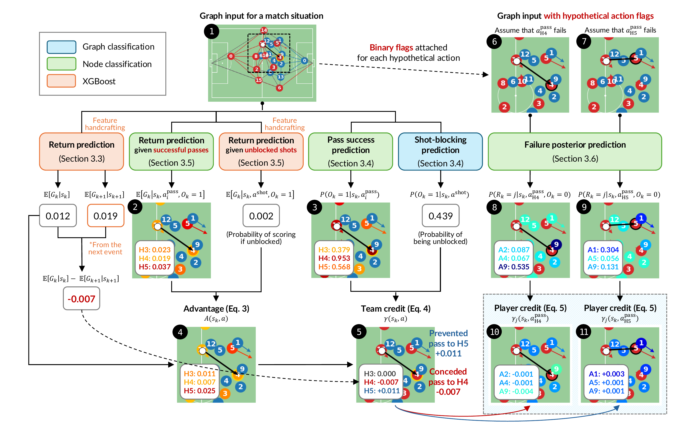
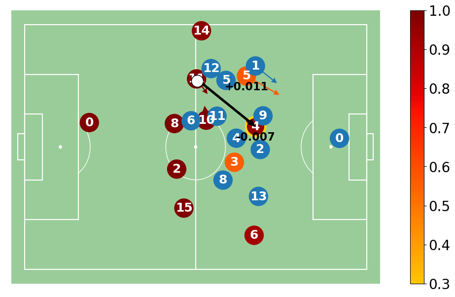
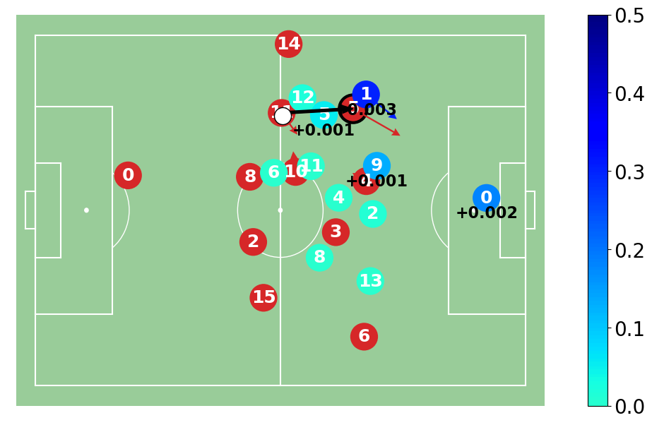
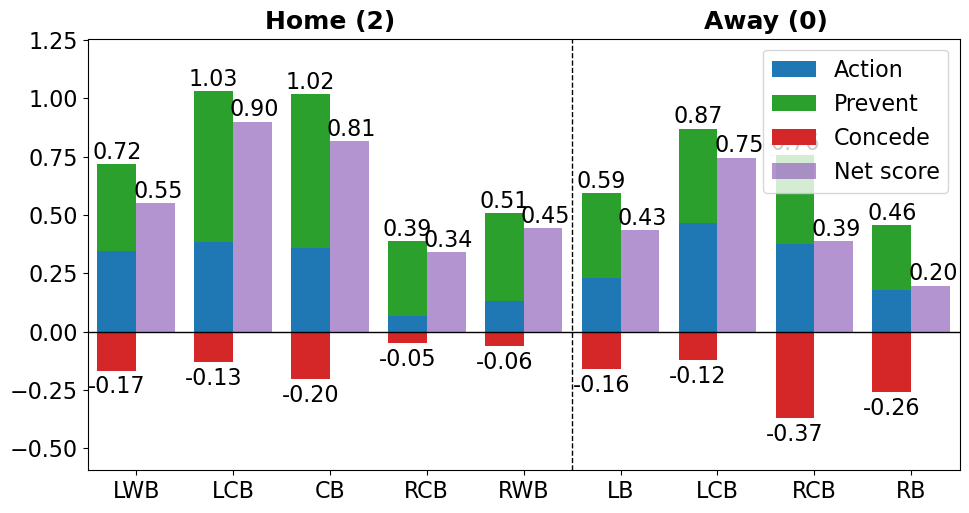

<div align="center">
	<h1>
		DEFCON
	</h1>
</div>

Source code for the paper **Better Prevent than Tackle: Valuing Defense in Soccer Based on Graph Neural Networks** by Kim et al., 2025 (under review).

## Introduction
**DEFCON (DEFensive CONtribution evaluator)** is a framework for evaluating the defensive contribution of soccer players in terms of reducing the expected return of the opposing team in a given situation.

<br>


## Data Availability
Our code requires tracking data in the [kloppy](https://kloppy.pysport.org) format and event data in the [SPADL](https://socceraction.readthedocs.io/en/latest/documentation/spadl/spadl.html) format. However, the dataset used in this project is proprietary and cannot be publicly shared as it is an internal asset of the data provider.

If you have your own event and tracking datasets, you can use them for training and testing component models described below. In the current implementation, the data should be placed in the following paths:
- Tracking data: per-match Parquet files in `data/ajax/tracking` directory
- Event data: A single parquet file at `data/ajax/event/event.parquet`
- Match lineups: A single parquet file at `data/ajax/lineup/line_up.parquet`

You can get a better understanding of the data usage by referring to the execution part at the bottom of `datatools/feature.py`.

## Detailed Instructions
The framework requires the estimation of six key components for a given moment of action as follows:
- [Section 3.2] **Expected return** indicating the difference between the goal-scoring and goal-conceding probabilities of the attacking team within the next 10 events.
- [Section 3.3.1] **Receiver selection probability** that each teammate of the passer becomes the target (i.e., the "intended" receiver) of a pass. This probability is not a main component of the defensive credit, but used in oversampling less-likely instances when training the following *pass success model*.
- [Section 3.3.1] **Pass success probability** that the pass to each teammate is successful.
- [Section 3.3.2] **Shot-blocking probability** that the shot made in the given situation would be blocked by a defender.
- [Section 3.4] **Success-conditioned expected return** indicating the expected return of the attacking team under the condition that the pass to each teammate was successful.
- [Section 3.5] **Failure-conditioned posterior probability** that each of the opposing defenders would have caused the failure if a pass or a shot failed.

### 1. Generating Features and Labels
Once you have formatted data and installed the packages listed in `requirements.txt`, you can generate features and labels for training and testing the component models by executing `datatools/feature.py` with `action_type` as an argument:
```
python datatools/feature.py --action_type {placeholder}
```
The placeholder should be either `all`, `pass`, `shot`, or `failure`, and varies according to the type of component. The corresponding `action_type` for each component is listed in Table 1 of the paper. Namely, the specific comments for generating features and labels for each component are as follows:
- [Section 3.2] Expected return: `python datatools/feature.py --action_type all`
- [Sections 3.3.1 and 3.4] Pass success probability, receiver selection probability, and success-conditioned expected return: `python datatools/feature.py --action_type pass`
- [Section 3.3.2] Shot-blocking probability: `python datatools/feature.py --action_type shot`
- [Section 3.5] Failure-conditioned posterior probability: `python datatools/feature.py --action_type failure`

### 2. Training Component Models
With proper features and labels, you can train individual GNN models by executing the following scripts:
- [Section 3.2] Expected return: `sh scripts/scoring.sh`
- [Section 3.3.1] Pass success probability: `sh scripts/intent_success.sh`
- [Section 3.3.1] Receiver selection probability: `sh scripts/intent.sh`
- [Section 3.3.2] Shot-blocking probability: `sh scripts/shot_blocking.sh`
- [Section 3.4] Success-conditioned expected returns: `sh scripts/intent_scoring.sh`
- [Section 3.5] Failure-conditioned posterior probability: `sh scripts/failure_receiver.sh`

Since our GNN models are based on [PyG](https://www.pyg.org), please make sure to install PyG whose version is compatible with your CUDA environment and PyTorch.

### 3. Evaluating Component Models
By running `test.py` with `model_id` that you want to evaluate as an argument, you can evaluate the model's predictive performance on test data. For example, if you want to evaluate the pass success model whose trial ID is 01, you can execute the following command:
```
python test.py --model_id intent_success/01
```

### 4. Calculating Defensive Scores per Player
Once you have trained all of the component models, you can calculate the per-match player scores by running `main.py`:
```
python main.py --result_path data/player_scores.parquet
```
The resulting Parquet file will be saved at the designated path.

### 5. Match Analysis with Visualization
By running cells in `tutorial.ipynb`, you can visualize a specific moment of the match with estimated component values for post-match analysis. As a result, the following example figure on the left side displays the **team credits** corresponding to passing options (including passes to red #4 and $5) in a given situation, where the color of each attacking player indicates the **success probability** of the pass targeted to the player. Meanwhile, the figure on the right side shows the **player credits** assigned to individual defenders for preventing a pass to red #5 from happening. Here, the color of each defender signifies the **interception probability** (i.e., the **failure posterior**) of him if the pass to red #5 failed.
<p align="center">
  
  
</p>

Also, you can plot the players' defensive scores of the match as the following example:

<p align="center">
  
</p>


